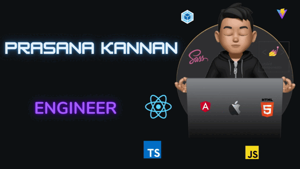

# 👋 Hello, I'm a Passionate Frontend / FullStack Developer!

With 10 years of experience in software development, I thrive on tackling engineering challenges and take immense pride in solving them. My expertise lies in working with **React**, a journey I've been on for more than 8 years. 🚀 

I'm passionate about optimization techniques to make web applications load faster. Additionally, I've reported multiple security vulnerabilities as part of my pentesting hobby, contributing to safer web environments. 

📚 I maintain the **puppeteer-screen-recorder** library, which has over   ! If you find my work valuable, please consider . Your support is greatly appreciated! 🙏

### My tech stack
                       

## 🛠️ My Notable Work
- **[Norton Password Manager](https://my.norton.com/extspa/passwordmanager)**
- **[Norton Safe Search](https://search.norton.com/mnOnboarding)**

## 🌐 Exploring Web3
Lately, I've been diving into the world of **Web3**. I'm actively learning:
-  Rust
-  Solana BlockChain
-  Anchor SmartContract  

Let's connect and collaborate on exciting projects! ✨

### GitHub Profile Trophy
 
 
    

   

 

